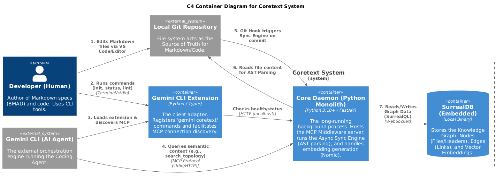
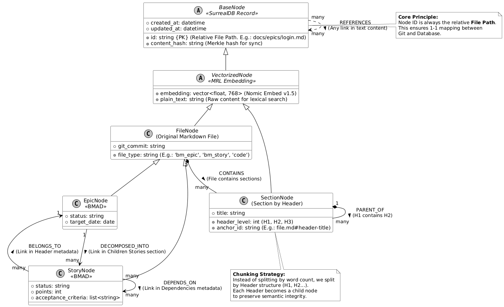
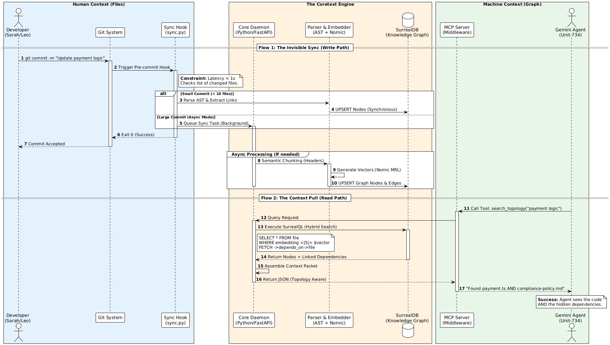
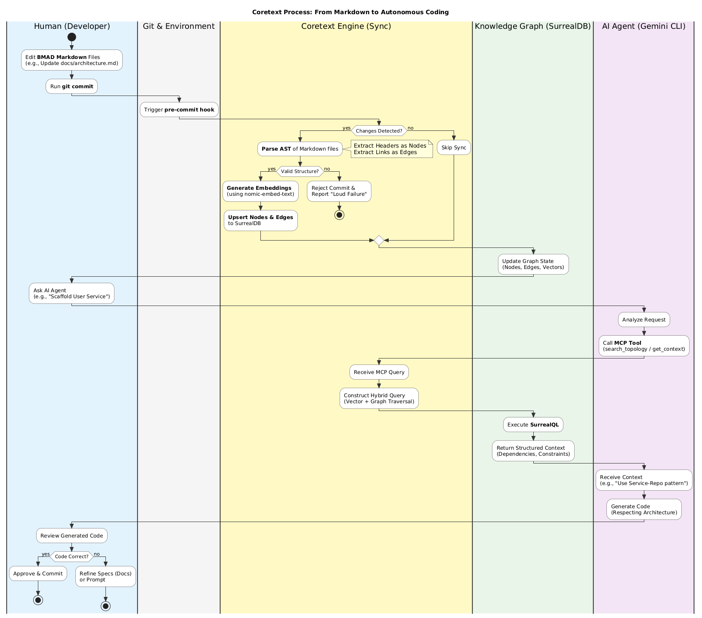
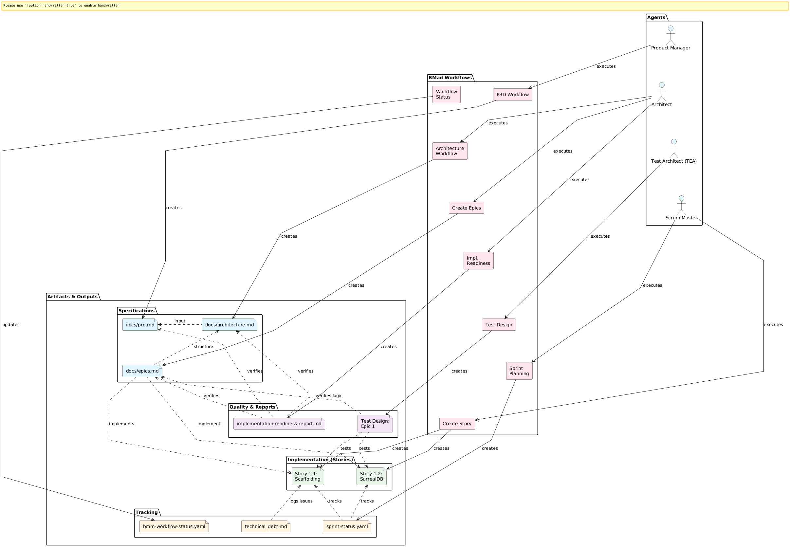

### Diagrams

#### C4 Container Diagram


#### Data Model Diagram


#### Sequence Diagram


#### Swimland Activity Diagram


#### Existing Documents Diagram


## Configuration

CoreText is configured via `.coretext/config.yaml` in your project root.

```yaml
# CoreText Configuration
daemon_port: 8010
mcp_port: 8001
log_level: DEBUG
docs_dir: .  # Directory containing your markdown documents (default: project root)
system:
  memory_limit_mb: 50
  background_priority: true
```

*   **docs_dir**: Specifies the folder where CoreText should look for Markdown files. Useful for excluding irrelevant folders like `node_modules` or `build`.

## Connecting with Surrealist

To explore your data using [Surrealist](https://surrealist.app/):

1.  Start the CoreText daemon: `coretext start`
2.  Open Surrealist.
3.  Create a new connection with these settings:
    *   **Endpoint:** `http://localhost:8010` (or `ws://localhost:8010/rpc`)
    *   **Namespace:** `coretext`
    *   **Database:** `coretext`
    *   **Authentication:** `None` (or `Anonymous`)


