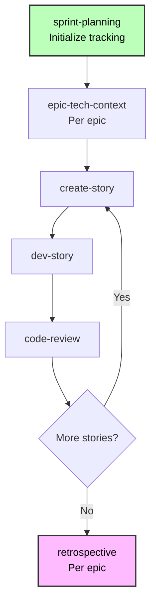

## REPORT: ENHANCING AGENTIC AGILE SOFTWARE DEVELOPMENT VIA KNOWLEDGE GRAPH INTEGRATION

## Chapter I. Introduction

### 1.1. Problem Statement

In modern software engineering, particularly within **Agentic Agile** frameworks like **BMAD** (Bedrock-Model-Agent-Development), documentation serves as the "source of truth" for autonomous AI agents. However, traditional documentation methods—relying on disconnected, unstructured text files (e.g., Markdown)—present significant challenges as project complexity scales.

Current limitations include:

1. **Context Window Overload:** Feeding entire documentation repositories into Large Language Models (LLMs) leads to high token costs and the "Lost in the Middle" phenomenon.
2. **Lack of Semantic Structure:** Flat text files fail to explicitly represent the topological relationships (dependencies, references, hierarchies) between requirements, design, and implementation.
3. **Data Integrity:** When requirements change, maintaining consistency across unstructured documents and subsequent code generation is prone to error.

### 1.2. Research Objective

This research proposes a methodological improvement to the BMAD framework by integrating a **Knowledge Graph (KG)** layer. The objective is to transform static, unstructured documentation into a dynamic, structured graph database. This allows AI agents to retrieve precise, granular context based on relationships rather than simple text matching.

### 1.3. Scope of Research

The research focuses on the **Specification, Design, and Testing** phases of the software lifecycle. It specifically targets the transition from human-written specifications (Artifacts) to machine-readable context (Graph Nodes/Edges) to support automated implementation.

### 1.4. Methodology Overview

The approach combines **Docs-as-Code** principles with **Graph Theory**. We propose a pipeline where documentation artifacts are parsed into semantic nodes, linked by explicit relationships, and exposed to agents via the **Model Context Protocol (MCP)**.

---

## Chapter II. Theoretical Background & Technology Stack

### 2.1. The Anatomy of a Coding Agent

*Why shouldn't I just dump all the documentation into the model?*

**Answer:** It's not that simple, because LLMs operate under constraints of context window size and token limits. Feeding large documents leads to inefficiencies and loss of relevant information. Instead, we need a structured approach where the agent can query specific, relevant pieces of information.

An AI coding agent can be abstractly defined as a function:

$Performance = f(Model, Tools, Context)$.

1. **Model:** The underlying LLM (e.g., GPT, Claude).
- This can be easily evaluated via benchmarks like HumanEval, SWE-bench.
- "Black box"
2. **Tools:** External utilities (e.g., code execution environments, databases).
3. **Context:** The information provided to the model to inform its decisions.
- This is where our research focuses: improving the "Context" component.

### 2.2. Agentic Agile & The BMAD Method

#### Why? (Problem)
Unlike generic AI coding assistants, BMad Method provides structured, battle-tested workflows powered by specialized agents who understand agile development. Each agent has deep domain expertise—from product management to architecture to testing—working together seamlessly.
- Scale-Adaptive
- Complete Development Lifecycle: Analysis → Planning → Architecture → Implementation 
#### What? (Solution)
BMad Method Module is based on BMad Method

#### How? (Result)

### 2.3. Knowledge Graph Theory

*\[PLACEHOLDER: Define Knowledge Graphs. Contrast them with Relational Databases and Vector Stores. Explain concepts like Nodes, Edges, Properties, and Traversal. Explain why Graphs are superior for handling "Dependencies" in software.\]*

### 2.4. Technology Stack

- **SurrealDB:** 
Selected for its multi-model capabilities (Graph + Document) and embedding support. (why not neo4j?)
- **Gemini CLI:** 
	- Large context window
	- Cached token (save a lot of token)
	- Open Source
	- Easy to export chat history and token usage and modification
	- Autom model selection
- **Abstract Syntax Tree (AST) Parsing:** For analyzing Markdown structure.
- **Model Context Protocol (MCP):** The standard interface for connecting AI agents to the Knowledge Graph.

---

## Chapter III. Related Work

Case study of 2 main coding agent memory approach

#### Approach 1: Graph-based (Sourcegraph)
1. Repo Map
	- AST Parsing
	- Ranking 
2. Retrieval via RAG + Keyword
3. Full Content
#### Approach 2: Agentic Context Isolation (Claude Code)
1. Planning
2. Context Isolation for sub-agent (Focusing)
3. Execution

-> Lack of structured knowledge representation in both approaches

---

## Chapter IV. Analysis, Design, and Methodology (Core Chapter)

### 4.1. The Proposed Workflow: From Text to Knowledge

We introduce a formalized process consisting of four distinct stages, defining the interaction between Human Operators and the System.

#### Stage 1: Specification (Human-Driven)

- **Actor:** Human Product Owner / Developer.
- **Input:** Requirements, Stories, and Epics written in Markdown (Standard BMAD format).
- **Constraint:** Documents must follow specific structural conventions (headers, links) to ensure parseability.

#### Stage 2: Abstraction & Ingestion (System-Driven)

- **Actor:** The Knowledge Engine (CoreText Algorithm).
- **Process:**
	1. **Ingestion:** The system reads the raw file artifacts.
	2. **Decomposition:** Files are not treated as atomic units. Instead, an **AST Parser** breaks them down into granular **Nodes** (Files, Headers, Code Blocks).
	3. **Topological Mapping:** The system identifies implicit links (wiki-links, parent-child headers) and converts them into explicit **Edges** in the database.

#### Stage 3: Knowledge Persistence (The Graph Model)

We define a formal Data Model where:

- **Vertices ():**
	- `FileNode`: Represents a physical artifact.
	- `HeaderNode`: Represents a logical section (e.g., a specific User Story or Acceptance Criteria).
- **Edges ():**
	- `CONTAINS`: Relationship between File and Header.
	- `PARENT_OF`: Hierarchical relationship between H1 -> H2 -> H3.
	- `REFERENCES`: Directional relationship where one node cites another (e.g., Story A depends on UI Component B).

*\[Insert Diagram: Visual representation of the Data Model - Node Types and Relationships\]*

#### Stage 4: Contextual Retrieval (Agent-Driven)

- **Actor:** AI Agent (via Orchestrator).
- **Interface:** Model Context Protocol (MCP).
- **Mechanism:** Instead of loading full files, the Agent queries the topology.
	- *Example Query:* "Find all Stories referenced by `auth_service`."
	- *Result:* The graph traverses backlinks and returns only the relevant logical nodes, minimizing noise.

### 4.2. Detailed Implementation Algorithms

#### 4.2.1. Deterministic Node Identity

To ensure idempotency (avoiding duplicate nodes during updates), we implement a deterministic ID generation algorithm based on normalized file paths and header slugs:

This allows the system to perform `UPSERT` operations efficiently, maintaining data integrity without full database wipes.

#### 4.2.2. The Parsing Strategy

The parsing logic utilizes a "Stack-based State Machine" to track the hierarchy of headers during file processing.*\[PLACEHOLDER: Describe the logic from `markdown.py`. How it iterates through tokens, maintains a stack of active parents, and creates edges dynamically.\]*

#### 4.2.3. Synchronization Engine

*\[PLACEHOLDER: Describe the logic in `engine.py`. How it handles Git Hooks (Pre-commit/Post-commit) to ensure the Knowledge Graph is always synchronized with the file system.\]*

### 4.3. Architecture Design

The system follows a layered architecture:

1. **CLI/Hook Layer:** Entry point for file events.
2. **Core Domain Layer:** Contains the Graph Logic and Parser.
3. **Database Layer:** SurrealDB instance holding the persistent graph.
4. **Interface Layer:** MCP Server exposing tools (`read_graph`, `search_nodes`) to external Agents.

---

## Chapter V. Results and Evaluation

### 5.1. Experiment 1: Self-Reflexive Case Study (Project CoreText)
- Context: Build the engine coretext with BMad Module (no graph)
- Workflow: 
### 5.2. Experiment 2: Application Case Study (Project Nhaminhbach)

We applied this methodology to the "Nhaminhbach" (Rental Finding Platform) project.

- **Input:** A set of Markdown files describing User Stories and Database Schemas.
- **Graph Construction:** The system generated a graph containing nodes and edges.
- **Visualization:**

### 5.3. Evaluation Metrics

*\[PLACEHOLDER: Compare the "Old BMAD" way vs. the "New Graph" way.\]*

- **Context Precision:** (Theoretical) Graph retrieval provides higher signal-to-noise ratio than file dumping.
- **Token Efficiency:** Reduced token usage per query due to targeted node retrieval.
- **Scalability:** The system maintains performance as file count increases, whereas standard context windows degrade.

### 5.4. Limitations & Future Work

- **Current Limitation:** Handling file deletions and renames (Ghost Nodes).
- **Future Work:** Implementing Vector Embeddings for Semantic Search alongside Graph Traversal.

### 5.5. Conclusion

The integration of a Knowledge Graph into the BMAD framework shifts the paradigm from "Document-Centric" to "Knowledge-Centric" development. This abstraction allows AI agents to operate with a structural understanding of the software, paving the way for more autonomous and accurate software engineering workflows.
